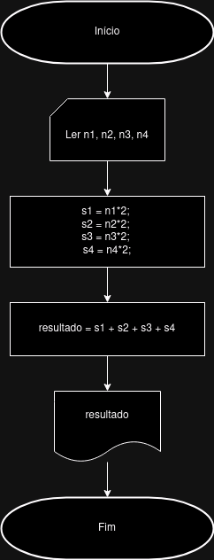

# Desenvolva a descrição narrativa e o fluxograma que:
- Leia 4 números
- Calcule o dobro para cada um
- Some todos e
- Mostre o resultado

## Resposta

### Descrição narrativa:
#### Dados de entrada:
1. Informe as notas do aluno

#### Processamento:
2. Multiplique cada número por 2
3. Some os resultados de cada multiplicação

#### Dados de saída
4. Mostrar o resultado da soma

### Fluxograma

