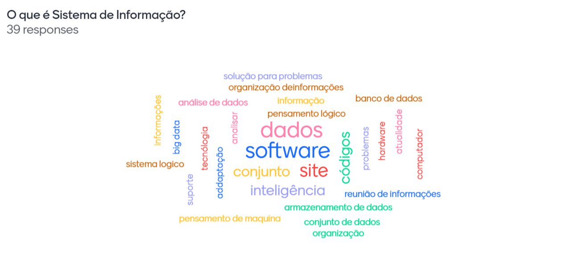

<small>O que é um sistema de informação</small>
# Informação

Informação nada mais é do que um conjunto de dados **processados**.

## Exemplo de Dado

Dado é um componente individual, isolado. 
Um número pode ser um dado, como:

- O número 35 pode ser identificado como:
    - Idade
    - Um múltiplo de 5
    - É ímpar
- Porém, para que ele seja uma informação, precisamos transformar esse dado em algo que seja utilizável.

# Sistema

O sistema é um grupo de itens que interagem entre si e podem automatizar tarefas. Um conjunto de funções que **coletam, processam, armazenam e distribuem** informações podem ser considerados um sistema.

### Componentes do S.I.:

```
   Entrada -> Processamento -> Saída
     ^             ^             ^
     |---------Feedback----------|    
```

- Uma **entrada** é uma atividade de captura de dados
- O **processamento** é a transcrição desses dados em algo útil
- A **saída** é o resultado do processamento, geralmente em forma de documentos e relatórios
- E ainda existe a **realimentação**, onde essas informações são utilizadas para corrigir, ajustar ou melhorar o processamento

### O desempenho de um SI é definido pela eficiência, eficácia e o cumprimento do padrão de desempenho

- A eficiência é indicada pela saída X entrada, o que é produzido / o que é consumido
- A eficácia é a medida que expressa até que ponto o sistema atinge
- O padrão de desempenho são os objetivos que o sistema deve atingir
<br><br>
<center><b>O objetivo de um SI é o auxílio na tomada de decisão</b></center>
<br>

Os SI são importantes para manter a **produtividade, oportunidades, vantagens, estratégias e minimizar o capital investido para a realização da tarefa**.

Quanto mais um sistema cresce, mais informação ele armazena, mais processos ele realiza e mais **complexo** ele fica. Por isso, um SI é mutável, dinâmico, ele geralmente tem a **interligação** de diversas tecnologias e oferece o suporte à **tomada de decisão**, juntamente ao **auxílio de qualidade, produtividade e competitividade organizacional**

## Tipos de SI

- Um sistema de **transação** é aquele que é utilizado para **registrar tarefas** rotineiras da empresa (**Processamento de informação**)
    - Seja um Controle de estoque, produção, emissão de NFe, RH...
- Um sistema de **automação de escritório** tem o objetivo de auxiliar os processos executados em um escritório (**Automação**)
    - Seja um processador de texto, cálculo, gerenciador de planilha ...
- Sistema de **apoio gerencial** é mais utilizado para a gestão de uma empresa (**Gestão**)
    - É aquele que oferece um conjunto de relatórios resumidos sobre o desempenho da empresa
- Um sistema de **apoio gerencial** permite a consulta de dados (**Visualização de dados**)
    - Permitem a visualização de relatórios, visualização de dados que são ferramentas incorporadas a algum tipo de gerenciador de banco de dados.
- Sistema de **suporte à decisão** é aquele que permite a interatividade com as ações dos usuários (**Tomada de decisão**)
    - Eles oferecem dados e modelos para problemas semi-estruturados e tem o foco na tomada de decisão
- Sistema de **suporte executivo** é aquele que é ligado ao alto escalão da empresa, que dão suporte ao planejamento estratégico da empresa (**Estratégia**)
    - Esses sistemas auxiliam a definir objetivos a serem estabelecidos
- Sistema de **processamento de dados** visa armazenar, gerenciar e processar uma grande quantidade de informações para transações rotineiras (**Processamento de dados**)
- O Sistema de **Informação Geográfica** é um tipo de sistema que possui vários sistemas e equipamentos interligados. (**Satélites, GPS ...**) 
    - Assim ele consegue também consegue armazenar e processar dados de forma mais refinada
- Sistemas **Especialistas** são ligados ao campo de IA, no qual o computador é utilizado para assistir ou substituir os tomadores de decisão (**ChatGPT, Gemini, BingAI**)

## Atores Principais dos SI

- Fornecedores de hardware e software
- Negócios da empresa
- Gerência e funcionários
- Ambiente da empresa (jurídico, social, contexto cultural)

<center><b>Investir em TI não garante uma boa rentabilidade</b></center>