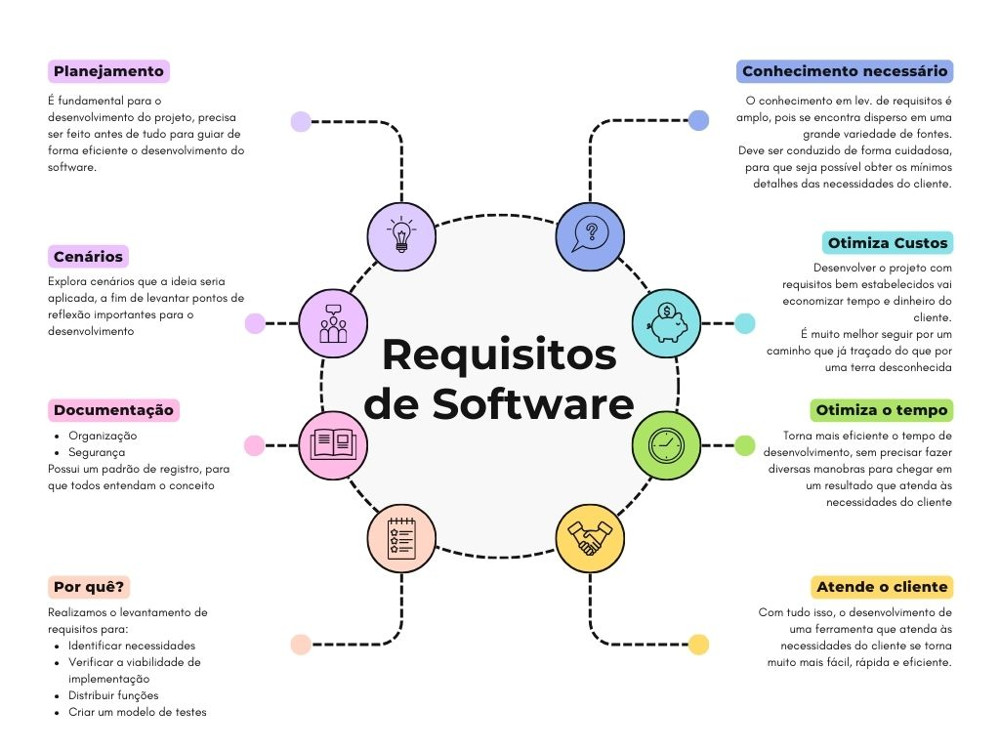

# Requisitos de Software

É a descrição das funções e restrições que o software precisa ter

<h2>Requisito de Software X Regra de negócio</h2>

- O requisito é uma **necessidade**, já a regra de negócio é uma **diretriz**
- Um requisito é algo mais parecido como uma idealização de algo que o cliente precisa, por exemplo:
    - Um cadastro
    - Uma coloração utilizada nas páginas
    - Como a listagem dos produtos deve ser...
- Já uma regra é algo que quebra esses requisitos em etapas lógicas, por exemplo:
    - O formulário terá quantos campos? Terá validação? Quais campos são obrigatórios?
    - A coloração será utilizada em quais elementos?

 

<h1>Mapa mental de Requisitos Mínimos</h1>

